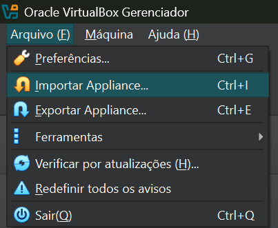
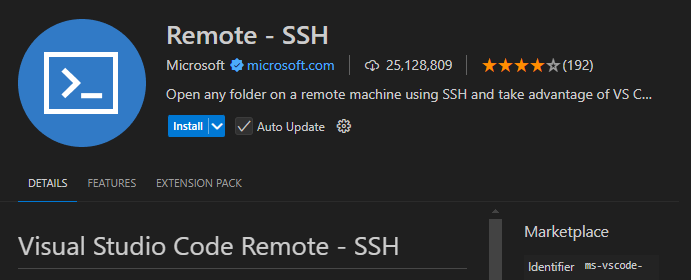
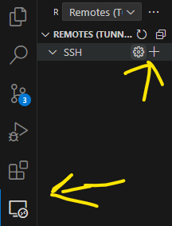
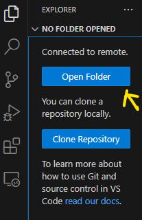
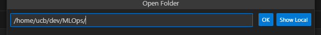
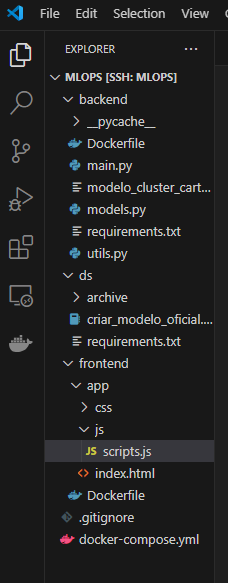
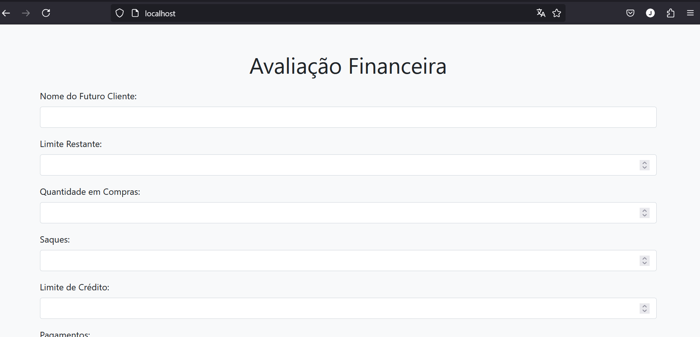

# Introdução ao MLOps

Como colocar modelos de aprendizado de máquinas em produção.

Desejamos criar um modelo de aprendizado de máquinas de clusterização com o dados da próxima seção e torná-lo acessível pela internet.

### Origem do dados

Os dados foram baixados de [kaggle.com](https://www.kaggle.com/datasets/arjunbhasin2013/ccdata).

## Requisitos

* Virtual Box

* Visual Studio Code

## Download do servidor

Baixe o servidor no seguinte link: [servidor](https://ubecedu-my.sharepoint.com/:u:/g/personal/jefferson_rodrigues_p_ucb_br/EQtRlEAv2b5NtL26dVecqg4BmCrCMjHBDLazd7_YTazwEw?e=kYqhTw)

Pessoal, peço desculpas, era para ele ocupar uns 200 MB, está com mais de 2 GB.

Para baixar, é necessário estar autenticado com o e-mail institucional.

### Adicionando no Virtual Box

Adicione o servidor no Virtual Box:

Clique em Arquivo->Importar Appliance...



Após ter o servidor instalado, clique em Iniciar para iniciá-lo. :green_heart::arrow_forward:

## Conexão com o Servidor


### Adicionando a Extensão
O primeiro passo é instalar o remote-ssh no VSCode, vá em extensões e instale:



### Configurando e Conectando
Um novo menu lateral vai surgir, clique nele e crie uma nova conexão:



Se for necessário configurar a conexão ssh, adicione o seguinte código no config do .ssh:

```cmd
Host MLOps
	HostName localhost
	User ucb
	Port 2222
```

Vai aparecer a opção de conectar com a máquina MLOps.

Conecte com ela e, quando pedir senha, a senha é `ucb`.

### Configurando o ambiente no VSCode:

Clique em `Open Folder`:



Navegue até a página com os arquivos do servidor:



Deve aparecer uma tela parecida com isso:



Preste atenção que a pasta principal deve estar: `MLOPS [SSH: MLOPS]`

## Iniciar servidor

Para iniciar o servidor, abra um novo terminal e digite:

```cmd
docker compose up -d
```

Após terminar de executar, abra o navegador e digite:

```cmd
localhost
```

Deve aparecer uma página assim:



### Parabéns

Se você chegou até aqui, você conseguiu iniciar seu primeiro projeto de um modelo de aprendizado de máquinas em produção. :stuck_out_tongue: :tada: :confetti_ball:

Adicione alguns dados e veja o que o modelo responde. :smile: :stuck_out_tongue_winking_eye:

Após se familiarizar com o projeto, inicie as atividades. :muscle: :sunglasses: :airplane:

# Atividades

### Estude o que foi feito <span style="color: #CCC; border-radius: 10px; padding: 2px 5px;font-size:0.7em;border: 1px solid #CCC">básico</span>

Estude primeiramente o notebook que cria o modelo de ML.

Estude os códigos do backend e frontend.

### O Banco com a Minha Cara <span style="color: green; border-radius: 10px; padding: 2px 5px;font-size:0.7em;border: 1px solid green">fácil</span>

Modifique os arquivos do `frontend` para ficar com o seu jeito.

* Crie um nome e uma marca para seu banco.
* Acrescente `placeholders` para os campos.
* Adicione validadores e delimitadores nos campos.
* Acrescente cores conforme sua marca.

### Armazenamento de informações <span style="color: yellow; border-radius: 10px; padding: 2px 5px;font-size:0.7em;border: 1px solid yellow">médio</span>

Modifique o `backend` para que salve os dados cadastrados em alguma base de dados.

### Evolução do Modelo de ML <span style="color: red; border-radius: 10px; padding: 2px 5px;font-size:0.7em;border: 1px solid red">difícil</span>

Como novos dados inseridos, atualize o modelo para ver se ele mantém os mesmos núcleos.

Importante: Você tem que iniciar os núcleos nas posições antigas.

Se você iniciar em posições aleatórias, você terá que modificar os resultados também. Deverá fazer uma nova análise.

Sugestão: Refaça a análise, quando ficar do seu agrado fixe os núcleos.

### Evolução do Modelo de ML, parte 2 <span style="color: darkred; border-radius: 10px; padding: 2px 5px;font-size:0.7em;border: 1px solid darkred">difícil</span>

A análise do modelo não está 100%, recomendo carregar o modelo e os clusters e fazer um `describe` em cada campo de cada núcleo (você pode fazer um groupby nos clusters separados por campo) e ver como os clientes estão distribuídos, você vai ver que há clientes que não atendem a análise.

[pandas: groupby](https://pandas.pydata.org/docs/reference/api/pandas.DataFrame.groupby.html)

[pandas: describe](https://pandas.pydata.org/docs/reference/api/pandas.DataFrame.describe.html)

[matplotlib: boxplot](https://matplotlib.org/stable/plot_types/stats/boxplot_plot.html#sphx-glr-plot-types-stats-boxplot-plot-py)

### Evolução automática de Modelos <span style="color: green; border-radius: 10px; padding: 2px 5px;font-size:0.7em;border: 1px solid green">fácil</span>

Pesquise sobre `Airflow` e como essa e outras ferramentas são utilizadas para gerenciar modelos de ML.

### Github Actions <span style="color: green; border-radius: 10px; padding: 2px 5px;font-size:0.7em;border: 1px solid green">fácil</span>

Pesquise sobre Github Actions e como essa tecnologia é utilizada para automatizar desenvolvimento.

# Atividades Extras

### O Banco com a Minha Cara, parte 2 <span style="color: red; border-radius: 10px; padding: 2px 5px;font-size:0.7em;border: 1px solid red">difícil-opcional</span>

Para o `frontend` utilize alguma framework front-end.

### Testes Unitários <span style="color: yellow; border-radius: 10px; padding: 2px 5px;font-size:0.7em;border: 1px solid yellow">médio-opcional</span>

Crie testes unitários para validar se as funções estão funcionando corretamente.

# Dúvidas

Se estiver com alguma dúvida, abra uma [nova issue](https://github.com/jefferson-rodrigues-ucb/oficina-mlops/issues/new?template=Blank+issue).

Talvez sua dúvida já está lá, [issue](https://github.com/jefferson-rodrigues-ucb/oficina-mlops/issues).

O uso de issues no GitHub facilita a organização, colaboração e documentação
de tarefas e bugs.

Também pode me enviar um e-mail: jefferson.rodrigues@p.ucb.br

# PS

Pessoal, desculpa pela demora na hora de criar o roteiro.

Aconteceu que meu PC estragou, perdi acesso aos meus arquivos.

Comprei a peça e troquei já no começo de Janeiro. Em Janeiro entrei de férias e perdi acesso ao Onedrive, por isso o roteiro só saiu em Fevereiro.

Além disso, precisei fazer a atualização dos softwares que utilizei, as versões que tinha quando iniciei o roteiro não eram compatíveis com a atual versão do SO.
